# Backend → Backend asynkron kommunikasjon (Kafka)

Oversikt over all asynkron kommunikasjon via Kafka for backend-appene, **ekskludert** apper som ligger i `toi-rapids-and-rivers`-repoet (de er dokumentert i eget repo).

## Topics

| Topic | Pool | Beskrivelse |
|-------|------|-------------|
| `toi.rapid-1` | nav-prod | Rapids & Rivers topic — intern event-buss for teamet |
| `toi.rekrutteringsbistand-stilling-1` | nav-prod | Kompaktert stilling-topic (kopiert fra pam) |
| `toi.kandidatutfall` | nav-prod | Kandidatutfall til Datavarehus (Avro) |
| `teampam.stilling-ekstern-1` | nav-prod | Ekstern stilling-topic fra teampam (kilde) |
| `pto.deling-av-stilling-fra-nav-forespurt-v2` | nav-prod | Forespørsel om deling av CV til aktivitetsplanen |
| `pto.stilling-fra-nav-oppdatert-v2` | nav-prod | Svar fra aktivitetsplanen på forespørsel |
| `pto.rekrutteringsbistand-statusoppdatering-v1` | nav-prod | Statusoppdatering til veilarbaktivitet |
| `min-side.aapen-brukervarsel-v1` | nav-prod | Bestilling av MinSide-varsel |
| `min-side.aapen-varsel-hendelse-v1` | nav-prod | Oppdateringer/svar fra MinSide-varsler |
| `dab.aktivitetskort-v1.1` | nav-prod | Aktivitetskort til DAB (aktivitetsplanen) |
| `dab.aktivitetskort-feil-v1` | nav-prod | Feilmeldinger tilbake fra DAB |

## Mermaid-diagram

```mermaid
graph TB
    %% === Interne apper ===
    kandidat-api[rekrutteringsbistand-kandidat-api]
    stilling-api[rekrutteringsbistand-stilling-api]
    foresporsel-api[foresporsel-om-deling-av-cv-api]
    presenterte-api[presenterte-kandidater-api]
    kandidatvarsel-api[rekrutteringsbistand-kandidatvarsel-api]
    statistikk-api[rekrutteringsbistand-statistikk-api]
    stilling-kafkabro[rekrutteringsbistand-stilling-kafkabro]
    rektreff-api[rekrutteringstreff-api]
    aktivitetskort-app[rekrutteringsbistand-aktivitetskort]

    %% === Topics ===
    rapid([toi.rapid-1])
    stilling-topic([toi.rekrutteringsbistand-stilling-1])
    kandidatutfall-topic([toi.kandidatutfall])
    stilling-ekstern([teampam.stilling-ekstern-1])
    foresporsel-topic([pto.deling-av-stilling-fra-nav-forespurt-v2])
    svar-topic([pto.stilling-fra-nav-oppdatert-v2])
    statusoppdatering-topic([pto.rekrutteringsbistand-statusoppdatering-v1])
    minside-bestilling([min-side.aapen-brukervarsel-v1])
    minside-hendelse([min-side.aapen-varsel-hendelse-v1])
    dab-aktivitetskort([dab.aktivitetskort-v1.1])
    dab-feil([dab.aktivitetskort-feil-v1])

    %% === Eksterne konsumenter ===
    veilarbaktivitet[veilarbaktivitet<br>team-dab]
    datavarehus[Datavarehus<br>teamoppfolging/team-dialog]
    minside[MinSide<br>tms]
    pam-ad[pam-ad-api<br>teampam]
    dab[DAB aktivitetsplan<br>team-dab]

    %% =====================================================
    %% rekrutteringsbistand-kandidat-api
    %% =====================================================
    kandidat-api -->|"WRITE: kandidat_v2.*<br>(OpprettetKandidatliste, OppdaterteKandidatliste,<br>DelCvMedArbeidsgiver, RegistrertDeltCv,<br>RegistrertFåttJobben, FjernetRegistreringDeltCv,<br>FjernetRegistreringFåttJobben, LukketKandidatliste,<br>SlettetStillingOgKandidatliste,<br>SlettFraArbeidsgiversKandidatliste)"| rapid

    %% =====================================================
    %% rekrutteringsbistand-stilling-api
    %% =====================================================
    stilling-api -->|"WRITE: indekserDirektemeldtStilling,<br>reindekserDirektemeldtStilling,<br>indekserStillingsinfo,<br>publiserEllerAvpubliserTilArbeidsplassen"| rapid
    stilling-api -.->|"READ: meldinger uten<br>stilling/stillingsinfo<br>(beriker med stillingdata)"| rapid
    stilling-api -.->|"READ: rekrutteringsbistand-stilling-1"| stilling-topic

    %% =====================================================
    %% rekrutteringsbistand-stilling-kafkabro (Aivia)
    %% =====================================================
    stilling-kafkabro -.->|"READ: teampam.stilling-ekstern-1"| stilling-ekstern
    stilling-kafkabro -->|"WRITE: kopierer stillinger"| stilling-topic
    pam-ad -->|"WRITE: publiserer stillinger"| stilling-ekstern

    %% =====================================================
    %% foresporsel-om-deling-av-cv-api
    %% =====================================================
    foresporsel-api -.->|"READ: kandidat_v2.DelCvMedArbeidsgiver<br>kandidat_v2.LukketKandidatliste<br>kandidat_v2.RegistrertFåttJobben"| rapid
    foresporsel-api -->|"WRITE: statusoppdatering<br>(CV_DELT, FATT_JOBBEN, IKKE_FATT_JOBBEN)"| statusoppdatering-topic
    foresporsel-api -->|"WRITE: ForesporselOmDelingAvCv (Avro)"| foresporsel-topic
    foresporsel-api -.->|"READ: DelingAvCvRespons (Avro)"| svar-topic
    veilarbaktivitet -.->|"READ: forespørsel"| foresporsel-topic
    veilarbaktivitet -->|"WRITE: svar"| svar-topic
    veilarbaktivitet -.->|"READ: statusoppdatering"| statusoppdatering-topic

    %% =====================================================
    %% presenterte-kandidater-api
    %% =====================================================
    presenterte-api -.->|"READ: kandidat_v2.DelCvMedArbeidsgiver<br>kandidat_v2.OpprettetKandidatliste<br>kandidat_v2.LukketKandidatliste<br>kandidat_v2.SlettetStillingOgKandidatliste<br>kandidat_v2.SlettFraArbeidsgiversKandidatliste"| rapid
    presenterte-api -->|"WRITE: notifikasjon.cv-delt"| rapid
    presenterte-api -->|"WRITE: arbeidsgiversKandidatliste.VisningKontaktinfo"| rapid

    %% =====================================================
    %% rekrutteringsbistand-kandidatvarsel-api
    %% =====================================================
    kandidatvarsel-api -.->|"READ: rekrutteringstreffinvitasjon<br>rekrutteringstreffoppdatering<br>rekrutteringstreffSvarOgStatus (avlyst)"| rapid
    kandidatvarsel-api -->|"WRITE: varselbeskjed"| minside-bestilling
    kandidatvarsel-api -.->|"READ: varseloppdateringer"| minside-hendelse
    kandidatvarsel-api -->|"WRITE: minsideVarselSvar"| rapid
    minside -.->|"READ: bestilling"| minside-bestilling
    minside -->|"WRITE: hendelser/status"| minside-hendelse

    %% =====================================================
    %% rekrutteringsbistand-statistikk-api
    %% =====================================================
    statistikk-api -.->|"READ: kandidat_v2.OpprettetKandidatliste<br>kandidat_v2.OppdaterteKandidatliste<br>kandidat_v2.DelCvMedArbeidsgiver<br>kandidat_v2.RegistrertDeltCv<br>kandidat_v2.RegistrertFåttJobben<br>kandidat_v2.FjernetRegistreringDeltCv<br>kandidat_v2.FjernetRegistreringFåttJobben<br>kandidat_v2.SlettetStillingOgKandidatliste<br>arbeidsgiversKandidatliste.VisningKontaktinfo"| rapid
    statistikk-api -->|"WRITE: kandidatutfall (Avro)"| kandidatutfall-topic
    datavarehus -.->|"READ: kandidatutfall"| kandidatutfall-topic

    %% =====================================================
    %% rekrutteringstreff-api
    %% =====================================================
    rektreff-api -->|"WRITE: rekrutteringstreffinvitasjon"| rapid
    rektreff-api -->|"WRITE: rekrutteringstreffoppdatering"| rapid
    rektreff-api -->|"WRITE: rekrutteringstreffSvarOgStatus"| rapid
    rektreff-api -->|"WRITE: behov synlighetRekrutteringstreff"| rapid
    rektreff-api -.->|"READ: synlighet.erSynlig (fra toi-synlighetsmotor)"| rapid
    rektreff-api -.->|"READ: synlighetRekrutteringstreff (need-svar)"| rapid
    rektreff-api -.->|"READ: aktivitetskort-feil"| rapid
    rektreff-api -.->|"READ: minsideVarselSvar"| rapid

    %% =====================================================
    %% rekrutteringsbistand-aktivitetskort
    %% =====================================================
    aktivitetskort-app -.->|"READ: rekrutteringstreffinvitasjon<br>rekrutteringstreffSvarOgStatus<br>rekrutteringstreffoppdatering"| rapid
    aktivitetskort-app -->|"WRITE: aktivitetskort (JSON)"| dab-aktivitetskort
    aktivitetskort-app -.->|"READ: feilmeldinger"| dab-feil
    dab -.->|"READ: aktivitetskort"| dab-aktivitetskort
    dab -->|"WRITE: feilmeldinger"| dab-feil

    %% === Styling ===
    classDef app fill:#5bb55b,stroke:#3a7a3a,color:#fff
    classDef topic fill:#4a90d9,stroke:#2c5f8a,color:#fff
    classDef external fill:#f5a623,stroke:#c17d0e,color:#fff

    class kandidat-api,stilling-api,foresporsel-api,presenterte-api,kandidatvarsel-api,statistikk-api,stilling-kafkabro,rektreff-api,aktivitetskort-app app
    class rapid,stilling-topic,kandidatutfall-topic,stilling-ekstern,foresporsel-topic,svar-topic,statusoppdatering-topic,minside-bestilling,minside-hendelse,dab-aktivitetskort,dab-feil topic
    class veilarbaktivitet,datavarehus,minside,pam-ad,dab external
```



## Legende

| Farge | Betydning |
|-------|-----------|
| 🟢 Grønn | Interne backend-apper (eget team) |
| 🔵 Blå | Kafka topics |
| 🟠 Oransje | Eksterne tjenester/konsumenter (andre team) |

Piler:
- **Heltrukket linje (→)** = WRITE (produserer meldinger)
- **Stiplet linje (-.->)** = READ (konsumerer meldinger)

## Detaljert oversikt per app

### rekrutteringsbistand-kandidat-api

**Skriver til `toi.rapid-1`:**

| Event | Trigger | Innhold |
|-------|---------|---------|
| `kandidat_v2.OpprettetKandidatliste` | Kandidatliste opprettes | stillingsId, organisasjonsnummer, antallKandidater |
| `kandidat_v2.OppdaterteKandidatliste` | Kandidatliste oppdateres | stillingsId, organisasjonsnummer, antallKandidater |
| `kandidat_v2.DelCvMedArbeidsgiver` | CV deles med arbeidsgiver | kandidater, stillingsId, epost, meldingTilArbeidsgiver |
| `kandidat_v2.RegistrertDeltCv` | Enkeltkandidat presentert | aktørId, synligKandidat, inkludering |
| `kandidat_v2.RegistrertFåttJobben` | Kandidat fått jobben | aktørId, synligKandidat, inkludering |
| `kandidat_v2.FjernetRegistreringDeltCv` | Presentering fjernet | aktørId |
| `kandidat_v2.FjernetRegistreringFåttJobben` | Fått-jobben fjernet | aktørId |
| `kandidat_v2.LukketKandidatliste` | Kandidatliste lukkes | aktørIderFikkJobben, aktørIderFikkIkkeJobben |
| `kandidat_v2.SlettetStillingOgKandidatliste` | Stilling slettet | stillingsId |
| `kandidat_v2.SlettFraArbeidsgiversKandidatliste` | Kandidat fjernet fra AG-liste | aktørId, stillingsId |

---

### rekrutteringsbistand-stilling-api

**Skriver til `toi.rapid-1`:**

| Event | Trigger | Innhold |
|-------|---------|---------|
| `indekserDirektemeldtStilling` | Ny/endret direktemeldt stilling | direktemeldtStilling, stillingsinfo |
| `reindekserDirektemeldtStilling` | Re-indeksering trigget | direktemeldtStilling, stillingsinfo |
| `indekserStillingsinfo` | Stillingsinfo endret | stillingsinfo |
| `publiserEllerAvpubliserTilArbeidsplassen` | Stilling publiseres/avpubliseres | direktemeldtStilling, stillingsinfo |

**Leser fra `toi.rapid-1` (StillingPopulator):**

Lytter på alle meldinger med `stillingsId` som mangler `stilling`/`stillingsinfo`/`direktemeldtStilling`. Beriker meldingen med stillings- og stillingsinfo-data og re-publiserer.

**Leser fra `toi.rekrutteringsbistand-stilling-1`:**

Mottar kompakterte stillingsmeldinger fra kafkabro.

---

### rekrutteringsbistand-stilling-kafkabro

Bruker [Aivia](https://github.com/nais/aivia) for å kopiere meldinger mellom topics:

| Fra | Til | Beskrivelse |
|-----|-----|-------------|
| `teampam.stilling-ekstern-1` | `toi.rekrutteringsbistand-stilling-1` | Speiler eksterne stillinger til intern topic |

---

### foresporsel-om-deling-av-cv-api

**Leser fra `toi.rapid-1`:**

| Event | Handling |
|-------|----------|
| `kandidat_v2.DelCvMedArbeidsgiver` | Sender statusoppdatering `CV_DELT` |
| `kandidat_v2.LukketKandidatliste` | Sender statusoppdatering `IKKE_FATT_JOBBEN` |
| `kandidat_v2.RegistrertFåttJobben` | Sender statusoppdatering `FATT_JOBBEN` |

**Skriver til `pto.deling-av-stilling-fra-nav-forespurt-v2`:**

Avro-melding (`ForesporselOmDelingAvCv`) med forespørsel om å opprette aktivitetskort i aktivitetsplanen.

**Leser fra `pto.stilling-fra-nav-oppdatert-v2`:**

Avro-melding (`DelingAvCvRespons`) med svar fra aktivitetsplanen (godkjent/avvist/svart).

**Skriver til `pto.rekrutteringsbistand-statusoppdatering-v1`:**

JSON-meldinger med type `CV_DELT`, `FATT_JOBBEN`, eller `IKKE_FATT_JOBBEN` for oppdatering av aktivitetsplanens status.

---

### presenterte-kandidater-api

**Leser fra `toi.rapid-1`:**

| Event | Handling |
|-------|----------|
| `kandidat_v2.DelCvMedArbeidsgiver` | Lagrer CV-delt-hendelse, trigger notifikasjon |
| `kandidat_v2.OpprettetKandidatliste` | Lagrer opprettet kandidatliste |
| `kandidat_v2.LukketKandidatliste` | Lukker kandidatliste |
| `kandidat_v2.SlettetStillingOgKandidatliste` | Markerer liste som slettet |
| `kandidat_v2.SlettFraArbeidsgiversKandidatliste` | Sletter kandidat fra liste |

**Skriver til `toi.rapid-1`:**

| Event | Trigger | Innhold |
|-------|---------|---------|
| `notifikasjon.cv-delt` | Etter CV delt med AG | notifikasjonsId, stillingsId, virksomhetsnummer, epost |
| `arbeidsgiversKandidatliste.VisningKontaktinfo` | Periodisk (outbox) | stillingsId, tidspunkt, aktørId |

---

### rekrutteringsbistand-kandidatvarsel-api

**Leser fra `toi.rapid-1`:**

| Event | Handling |
|-------|----------|
| `rekrutteringstreffinvitasjon` | Oppretter MinSide-varsel til jobbsøker |
| `rekrutteringstreffoppdatering` | Oppretter MinSide-varsel om endring |
| `rekrutteringstreffSvarOgStatus` (avlyst + svar=true) | Oppretter MinSide-varsel om avlysning |

**Skriver til `min-side.aapen-brukervarsel-v1`:**

Bestilling av MinSide-varsler (beskjed med SMS/epost) for rekrutteringstreff- og stilling-maler.

**Leser fra `min-side.aapen-varsel-hendelse-v1`:**

Mottar statusoppdateringer fra MinSide (opprettet, inaktivert, slettet, eksternStatusOppdatert).

**Skriver til `toi.rapid-1`:**

| Event | Trigger | Innhold |
|-------|---------|---------|
| `minsideVarselSvar` | Etter varsel levert/feilet | varselId, fnr, eksternStatus, minsideStatus, mal |

---

### rekrutteringsbistand-statistikk-api

**Leser fra `toi.rapid-1`:**

| Event | Handling |
|-------|----------|
| `kandidat_v2.OpprettetKandidatliste` | Lagrer kandidatlistehendelse |
| `kandidat_v2.OppdaterteKandidatliste` | Lagrer kandidatlistehendelse |
| `kandidat_v2.DelCvMedArbeidsgiver` | Lagrer utfall PRESENTERT |
| `kandidat_v2.RegistrertDeltCv` | Lagrer utfall PRESENTERT |
| `kandidat_v2.RegistrertFåttJobben` | Lagrer utfall FATT_JOBBEN |
| `kandidat_v2.FjernetRegistreringDeltCv` | Reverserer til IKKE_PRESENTERT |
| `kandidat_v2.FjernetRegistreringFåttJobben` | Reverserer til PRESENTERT |
| `kandidat_v2.SlettetStillingOgKandidatliste` | Markerer stilling slettet |
| `arbeidsgiversKandidatliste.VisningKontaktinfo` | Lagrer visning |

**Skriver til `toi.kandidatutfall`:**

Avro-meldinger med kandidatutfall for Datavarehus (konsumeres av `teamoppfolging-kafka` og `sf-kandidatutfall`).

---

### rekrutteringstreff-api

**Skriver til `toi.rapid-1`:**

| Event | Trigger | Innhold |
|-------|---------|---------|
| `rekrutteringstreffinvitasjon` | Jobbsøker invitert til treff | fnr, rekrutteringstreffId, tittel, tid, sted, svarfrist |
| `rekrutteringstreffoppdatering` | Treff endret etter publisering | fnr, rekrutteringstreffId, tittel, tid, sted, endredeFelter |
| `rekrutteringstreffSvarOgStatus` | Jobbsøker svarer / treff avlyses/fullføres | fnr, rekrutteringstreffId, svar, treffstatus |
| `behov` (synlighetRekrutteringstreff) | Scheduler finner jobbsøker uten synlighet | fodselsnummer |

**Leser fra `toi.rapid-1`:**

| Event/felt | Handling |
|------------|----------|
| `synlighet.erSynlig` (ferdigBeregnet=true) | Oppdaterer synlighetsstatus fra event-strøm |
| `synlighetRekrutteringstreff` (need-svar) | Oppdaterer synlighetsstatus fra need |
| `aktivitetskort-feil` | Registrerer at aktivitetskort-opprettelse feilet |
| `minsideVarselSvar` | Registrerer varselstatus fra MinSide |

---

### rekrutteringsbistand-aktivitetskort

**Leser fra `toi.rapid-1`:**

| Event | Handling |
|-------|----------|
| `rekrutteringstreffinvitasjon` | Oppretter aktivitetskort i outbox |
| `rekrutteringstreffSvarOgStatus` | Oppdaterer status på aktivitetskort |
| `rekrutteringstreffoppdatering` | Oppdaterer aktivitetskort-innhold |

**Skriver til `dab.aktivitetskort-v1.1`:**

JSON-meldinger i [AKAAS-format](https://navikt.github.io/aktivitetsplan-ekstern/) med aktivitetskort for rekrutteringstreff.

**Leser fra `dab.aktivitetskort-feil-v1`:**

Feilmeldinger fra DAB aktivitetsplan når aktivitetskort ikke kan opprettes/oppdateres. Publiserer `aktivitetskort-feil` på rapid for `rekrutteringstreff-api`.

---

## Meldingsflyt: Eksempler

### Jobbsøker inviteres til rekrutteringstreff

```
rekrutteringstreff-api
  → toi.rapid-1 [rekrutteringstreffinvitasjon]
    → rekrutteringsbistand-aktivitetskort (oppretter aktivitetskort)
      → dab.aktivitetskort-v1.1 [aktivitetskort]
    → rekrutteringsbistand-kandidatvarsel-api (oppretter varsel)
      → min-side.aapen-brukervarsel-v1 [varselbestilling]
```

### CV deles med arbeidsgiver

```
rekrutteringsbistand-kandidat-api
  → toi.rapid-1 [kandidat_v2.DelCvMedArbeidsgiver]
    → rekrutteringsbistand-stilling-api (beriker med stilling)
      → toi.rapid-1 [beriket melding]
        → foresporsel-om-deling-av-cv-api (sender statusoppdatering + forespørsel)
          → pto.rekrutteringsbistand-statusoppdatering-v1 [CV_DELT]
        → presenterte-kandidater-api (lagrer + sender notifikasjon)
          → toi.rapid-1 [notifikasjon.cv-delt]
        → rekrutteringsbistand-statistikk-api (lagrer utfall)
          → toi.kandidatutfall [Avro]
```

### Forespørsel om deling av CV

```
foresporsel-om-deling-av-cv-api
  → pto.deling-av-stilling-fra-nav-forespurt-v2 [ForesporselOmDelingAvCv]
    → veilarbaktivitet (oppretter aktivitet)
      → pto.stilling-fra-nav-oppdatert-v2 [DelingAvCvRespons]
        → foresporsel-om-deling-av-cv-api (oppdaterer status)
```

## Apper uten asynkron kommunikasjon

Følgende backend-apper har **ingen** Kafka-interaksjon:

- `rekrutteringsbistand-bruker-api` — kun REST API
- `rekrutteringsbistand-stillingssok-proxy` — kun REST proxy til OpenSearch
- `rekrutteringstreff-minside-api` — kun REST, delegerer til rekrutteringstreff-api
- `toi-kafkamanager` — admin-verktøy for toi.rapid-1 (har read/write-tilgang men brukes kun ad hoc)
