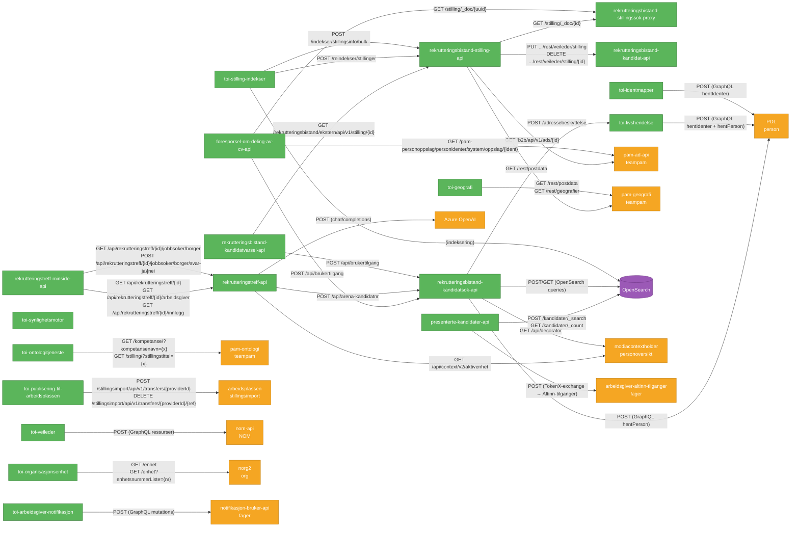

# Backend → Backend synkron kommunikasjon

## Legende

| Farge | Betydning |
|-------|-----------|
| 🟢 Grønn | Interne backend-apper (eget team) |
| 🟠 Oransje | Eksterne tjenester (andre team / Nav-felles) |
| 🟣 Lilla | Infrastruktur (OpenSearch) |

## Oversikt per app

### rekrutteringsbistand-stilling-api
| Kaller | URL | Auth |
|--------|-----|------|
| pam-ad-api | `GET /b2b/api/v1/ads/{id}` | Azure client_credentials |
| rekrutteringsbistand-kandidat-api | `PUT/DELETE .../rest/veileder/stilling/{id}` | Azure OBO |
| rekrutteringsbistand-stillingssok-proxy | `GET /stilling/_doc/{id}` | Azure OBO / system |
| pam-geografi | `GET /rest/postdata` | Ingen (cluster-intern) |

### foresporsel-om-deling-av-cv-api
| Kaller | URL | Auth |
|--------|-----|------|
| rekrutteringsbistand-kandidatsok-api | `POST /api/brukertilgang` | Azure OBO |
| rekrutteringsbistand-stillingssok-proxy | `GET /stilling/_doc/{uuid}` | Azure client_credentials |
| pam-personoppslag (via pam-ad-api) | `GET /pam-personoppslag/personidenter/system/oppslag/{ident}` | Azure client_credentials |

### presenterte-kandidater-api
| Kaller | URL | Auth |
|--------|-----|------|
| OpenSearch | `POST /kandidater/_search`, `GET /kandidater/_count` | Basic auth |
| arbeidsgiver-altinn-tilganger | `POST /` (tilgangsforespørsel) | TokenX |

### rekrutteringstreff-api
| Kaller | URL | Auth |
|--------|-----|------|
| modiacontextholder | `GET /api/context/v2/aktivenhet` | Azure OBO |
| rekrutteringsbistand-kandidatsok-api | `POST /api/arena-kandidatnr` | Azure OBO |
| Azure OpenAI | `POST /chat/completions` | API-nøkkel |

### rekrutteringstreff-minside-api
| Kaller | URL | Auth |
|--------|-----|------|
| rekrutteringstreff-api | `GET /api/rekrutteringstreff/{id}` | TokenX |
| rekrutteringstreff-api | `GET /api/rekrutteringstreff/{id}/arbeidsgiver` | TokenX |
| rekrutteringstreff-api | `GET /api/rekrutteringstreff/{id}/innlegg` | TokenX |
| rekrutteringstreff-api | `GET /api/rekrutteringstreff/{id}/jobbsoker/borger` | TokenX |
| rekrutteringstreff-api | `POST /api/rekrutteringstreff/{id}/jobbsoker/borger/svar-ja\|nei` | TokenX |

### rekrutteringsbistand-kandidatsok-api
| Kaller | URL | Auth |
|--------|-----|------|
| PDL | `POST (GraphQL)` | Azure OBO |
| toi-livshendelse | `POST /adressebeskyttelse` | Azure OBO |
| modiacontextholder | `GET /api/decorator` | Azure OBO |
| OpenSearch | diverse queries | Basic auth |

### rekrutteringsbistand-kandidatvarsel-api
| Kaller | URL | Auth |
|--------|-----|------|
| rekrutteringsbistand-stilling-api | `GET /rekrutteringsbistand/ekstern/api/v1/stilling/{id}` | Azure client_credentials |
| rekrutteringsbistand-kandidatsok-api | `POST /api/brukertilgang` | Azure OBO |

### toi-stilling-indekser
| Kaller | URL | Auth |
|--------|-----|------|
| rekrutteringsbistand-stilling-api | `POST /reindekser/stillinger` | Azure client_credentials |
| rekrutteringsbistand-stilling-api | `POST /indekser/stillingsinfo/bulk` | Azure client_credentials |
| OpenSearch | indeksering | Basic auth |

### toi-livshendelse
| Kaller | URL | Auth |
|--------|-----|------|
| PDL | `POST (GraphQL hentIdenter + hentPerson)` | Azure client_credentials |

### toi-identmapper
| Kaller | URL | Auth |
|--------|-----|------|
| PDL | `POST (GraphQL hentIdenter)` | Azure client_credentials |

### toi-veileder
| Kaller | URL | Auth |
|--------|-----|------|
| nom-api | `POST (GraphQL ressurser)` | Azure client_credentials |

### toi-organisasjonsenhet
| Kaller | URL | Auth |
|--------|-----|------|
| norg2 | `GET /enhet`, `GET /enhet?enhetsnummerListe={nr}` | Ingen |

### toi-ontologitjeneste
| Kaller | URL | Auth |
|--------|-----|------|
| pam-ontologi | `GET /kompetanse/?kompetansenavn={x}`, `GET /stilling/?stillingstittel={x}` | Ingen |

### toi-geografi
| Kaller | URL | Auth |
|--------|-----|------|
| pam-geografi | `GET /rest/postdata`, `GET /rest/geografier` | Ingen |

### toi-publisering-til-arbeidsplassen
| Kaller | URL | Auth |
|--------|-----|------|
| Arbeidsplassen stillingsimport | `POST /stillingsimport/api/v1/transfers/{providerId}` | Bearer token |
| Arbeidsplassen stillingsimport | `DELETE /stillingsimport/api/v1/transfers/{providerId}/{ref}` | Bearer token |

### toi-arbeidsgiver-notifikasjon
| Kaller | URL | Auth |
|--------|-----|------|
| notifikasjon-bruker-api | `POST (GraphQL mutations)` | Azure client_credentials |

## Apper uten utgående synkrone kall

Følgende backend-apper gjør **kun** asynkron kommunikasjon (Kafka) og har ingen utgående HTTP-kall til andre backends:

- `rekrutteringsbistand-bruker-api`
- `rekrutteringsbistand-statistikk-api`
- `rekrutteringsbistand-stilling-kafkabro`
- `toi-kafkamanager`
- `toi-arbeidsmarked-cv`
- `toi-arbeidssoekeropplysninger`
- `toi-arbeidssoekerperiode`
- `toi-hull-i-cv`
- `toi-kvp`
- `toi-oppfolgingsinformasjon`
- `toi-sammenstille-kandidat`
- `toi-siste-14a-vedtak`
- `toi-siste-oppfolgingsperiode`
- `toi-siste-oppfolgingsperiode-pond`
- `toi-synlighetsmotor`
- `toi-helseapp`
- `toi-publiser-dir-stillinger`
- `rekrutteringsbistand-aktivitetskort`
