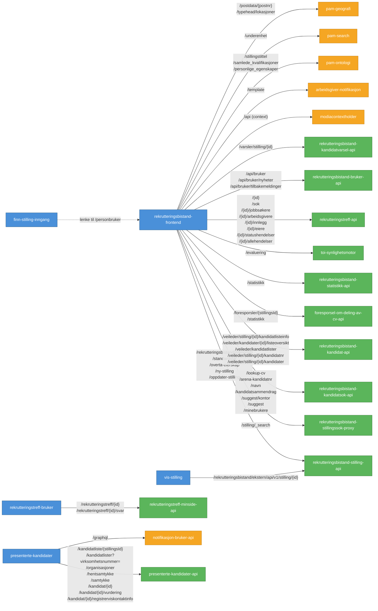

# Frontend → Backend kommunikasjon

## Legende

| Farge | Betydning |
|-------|-----------|
| 🔵 Blå | Frontend-apper (Next.js) |
| 🟢 Grønn | Backend-apper (eget team, Kotlin) |
| 🟠 Oransje | Eksterne tjenester (andre team) |

## Auth-mekanismer

| Frontend | Backend | Auth |
|----------|---------|------|
| rekrutteringsbistand-frontend | Alle interne backends | Azure AD OBO-token |
| presenterte-kandidater | presenterte-kandidater-api | TokenX (brukerkontext) |
| presenterte-kandidater | notifikasjon-bruker-api | TokenX (brukerkontext) |
| rekrutteringstreff-bruker | rekrutteringstreff-minside-api | TokenX (brukerkontext) |
| vis-stilling | rekrutteringsbistand-stilling-api | Azure client_credentials |
| finn-stilling-inngang | _(ingen backend-kall)_ | — |

## Notater

- **finn-stilling-inngang** er en mikrofrontend som kun lenker videre til rekrutteringsbistand-frontend
- **rekrutteringsbistand-frontend** er den sentrale saksbehandler-appen og kommuniserer med flest backends
- **vis-stilling** bruker client_credentials (maskin-til-maskin) fordi den viser stillinger til innbyggere uten brukerkontext
- **presenterte-kandidater** og **rekrutteringstreff-bruker** er innbygger-apper som bruker TokenX
