# Kommunikasjon per system

Samlet oversikt over all kommunikasjon (synkron og asynkron) per interne system. Dataene er kombinert fra:
- `frontend_til_backend.md` (frontend → backend)
- `backend_til_backend_synkron.md` (backend → backend HTTP)
- `backend_til_backend_asynkron.md` (backend → backend Kafka)

## Legende

| Symbol | Betydning |
|--------|-----------|
| **Heltrukket linje** (`-->`) | Synkront HTTP-kall |
| **Stiplet linje** (`-.->`) | Asynkron Kafka-kommunikasjon |
| 🔵 Blå | Frontend-apper |
| 🟢 Grønn | Interne backend-apper (eget team) |
| 🟠 Oransje | Eksterne tjenester (andre team) |
| 🟣 Lilla | Kafka topics |
| 🔲 Grå | Infrastruktur (OpenSearch) |

---

## rekrutteringsbistand-frontend

```mermaid
graph TB
    subgraph rekrutteringsbistand-frontend
        rekbis[rekrutteringsbistand-frontend]
    end

    %% Interne backends
    stilling-api[rekrutteringsbistand-stilling-api]
    stillingssok[rekrutteringsbistand-stillingssok-proxy]
    kandidatsok[rekrutteringsbistand-kandidatsok-api]
    kandidat-api[rekrutteringsbistand-kandidat-api]
    foresporsel[foresporsel-om-deling-av-cv-api]
    statistikk[rekrutteringsbistand-statistikk-api]
    synlighet[toi-synlighetsmotor]
    rektreff-api[rekrutteringstreff-api]
    bruker-api[rekrutteringsbistand-bruker-api]
    kandidatvarsel[rekrutteringsbistand-kandidatvarsel-api]

    %% Eksterne
    modia[modiacontextholder]
    ag-notifikasjon[arbeidsgiver-notifikasjon]
    pam-ontologi[pam-ontologi]
    pam-search[pam-search]
    pam-geografi[pam-geografi]

    %% Synkrone kall
    rekbis -->|"SYNC: /rekrutteringsbistandstilling/{id}<br>/standardsok /ny-stilling"| stilling-api
    rekbis -->|"SYNC: /stilling/_search"| stillingssok
    rekbis -->|"SYNC: /lookup-cv /arena-kandidatnr<br>/navn /kandidatsammendrag /suggest"| kandidatsok
    rekbis -->|"SYNC: /veileder/stilling/{id}/kandidater<br>/veileder/kandidatlister"| kandidat-api
    rekbis -->|"SYNC: /foresporsler/{stillingsId}<br>/statistikk"| foresporsel
    rekbis -->|"SYNC: /statistikk"| statistikk
    rekbis -->|"SYNC: /evaluering"| synlighet
    rekbis -->|"SYNC: /{id} /sok /{id}/jobbsøkere<br>/{id}/arbeidsgivere /{id}/innlegg"| rektreff-api
    rekbis -->|"SYNC: /api/bruker /api/bruker/nyheter"| bruker-api
    rekbis -->|"SYNC: /varsler/stilling/{id}"| kandidatvarsel
    rekbis -->|"SYNC: /api (context)"| modia
    rekbis -->|"SYNC: /template"| ag-notifikasjon
    rekbis -->|"SYNC: /stillingstittel<br>/samlede_kvalifikasjoner"| pam-ontologi
    rekbis -->|"SYNC: /underenhet"| pam-search
    rekbis -->|"SYNC: /postdata/{postnr}<br>/typehead/lokasjoner"| pam-geografi

    classDef frontend fill:#4a90d9,stroke:#2c5f8a,color:#fff
    classDef backend fill:#5bb55b,stroke:#3a7a3a,color:#fff
    classDef external fill:#f5a623,stroke:#c17d0e,color:#fff
    class rekbis frontend
    class stilling-api,stillingssok,kandidatsok,kandidat-api,foresporsel,statistikk,synlighet,rektreff-api,bruker-api,kandidatvarsel backend
    class modia,ag-notifikasjon,pam-ontologi,pam-search,pam-geografi external
```

---

## presenterte-kandidater

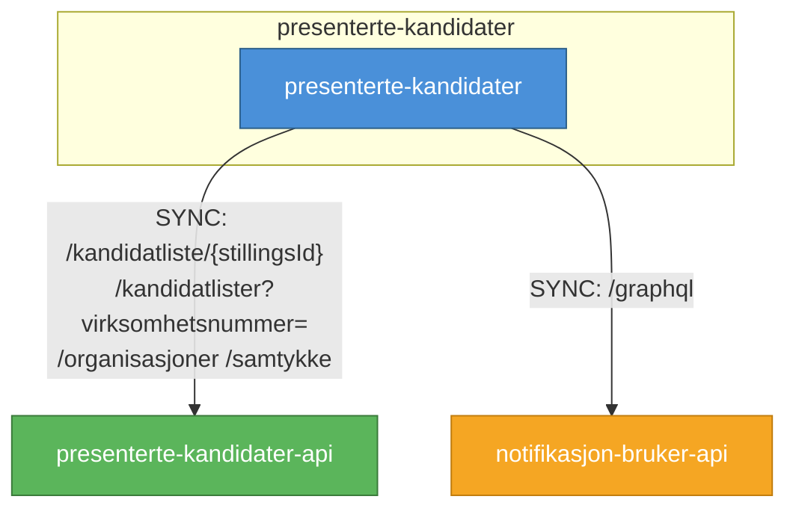

---

## rekrutteringstreff-bruker

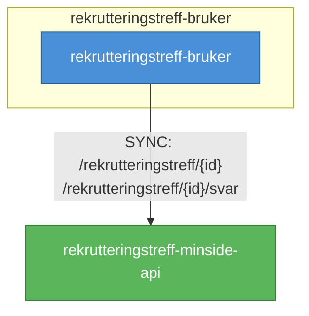

---

## vis-stilling

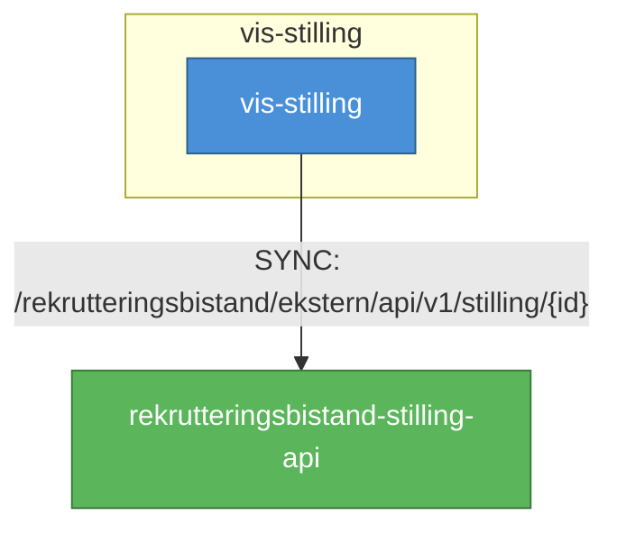

---

## rekrutteringsbistand-stilling-api

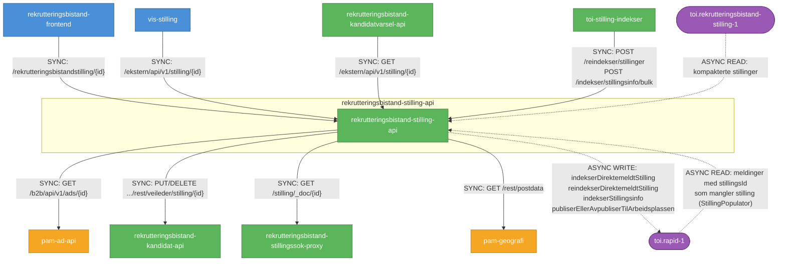

---

## rekrutteringsbistand-kandidat-api

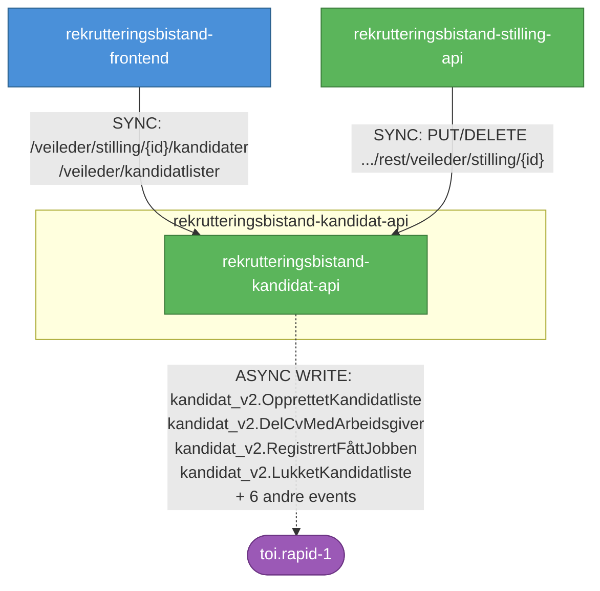

---

## foresporsel-om-deling-av-cv-api

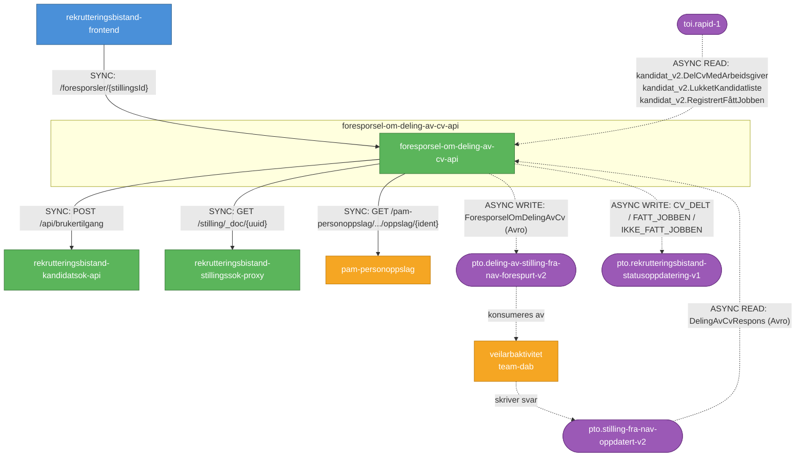

---

## presenterte-kandidater-api

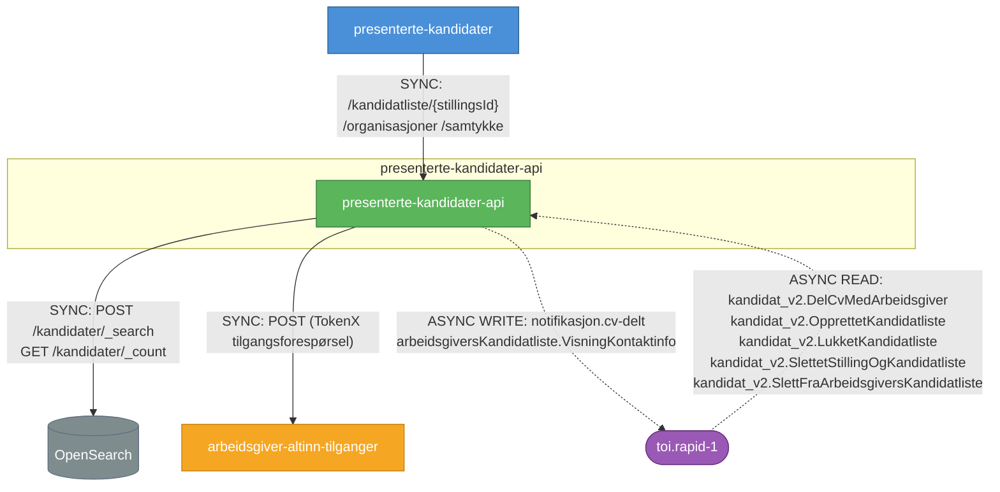

---

## rekrutteringstreff-api

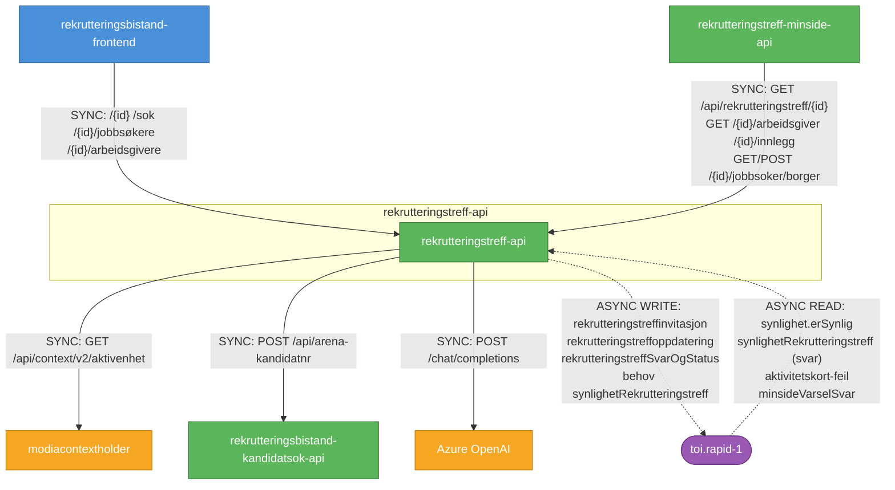

---

## rekrutteringstreff-minside-api

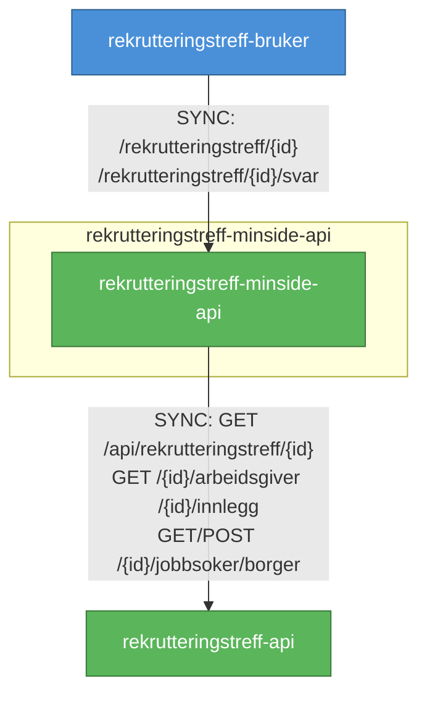

---

## rekrutteringsbistand-kandidatsok-api

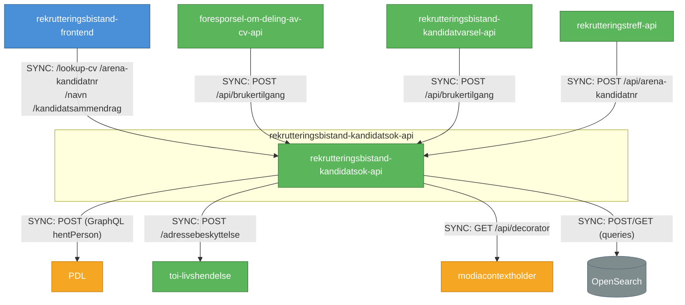

---

## rekrutteringsbistand-kandidatvarsel-api

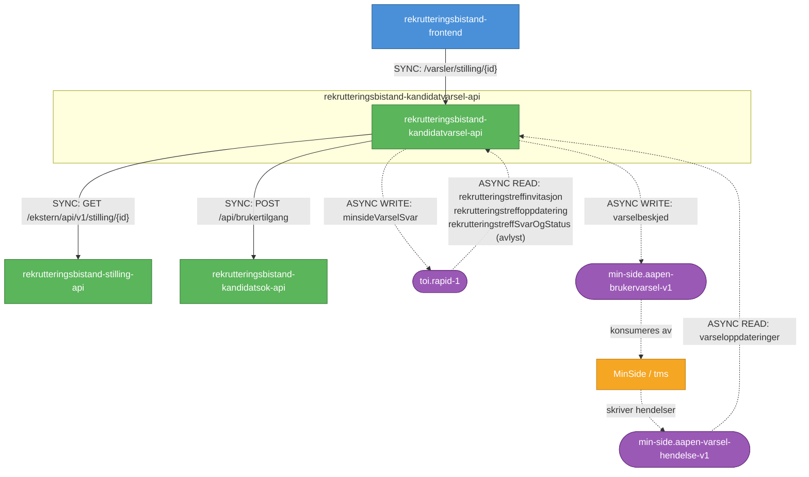

---

## rekrutteringsbistand-statistikk-api

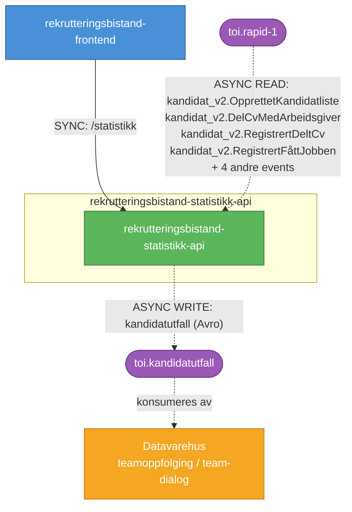

---

## rekrutteringsbistand-stilling-kafkabro

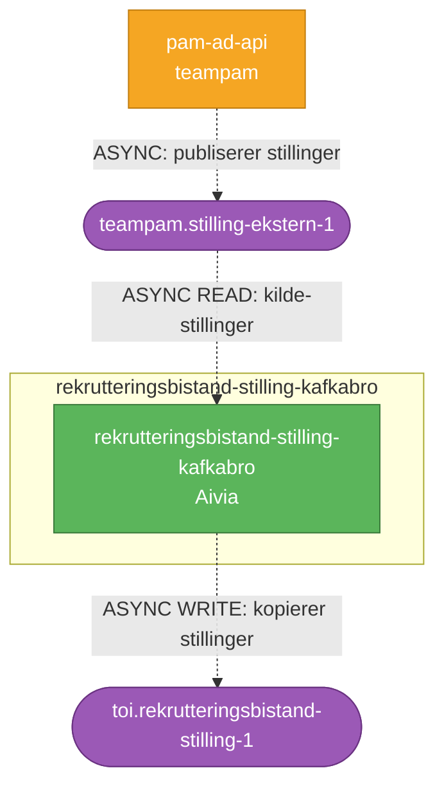

---

## rekrutteringsbistand-stillingssok-proxy

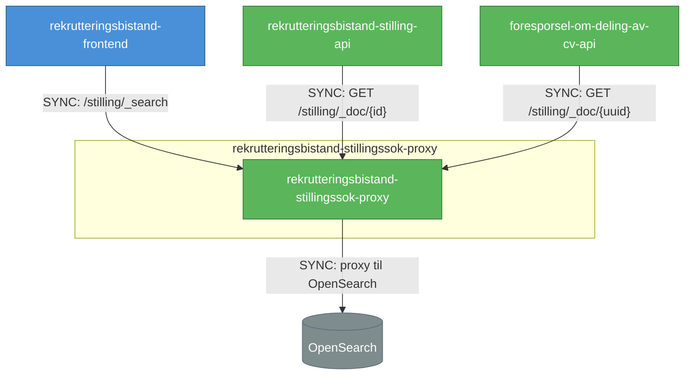

---

## rekrutteringsbistand-bruker-api

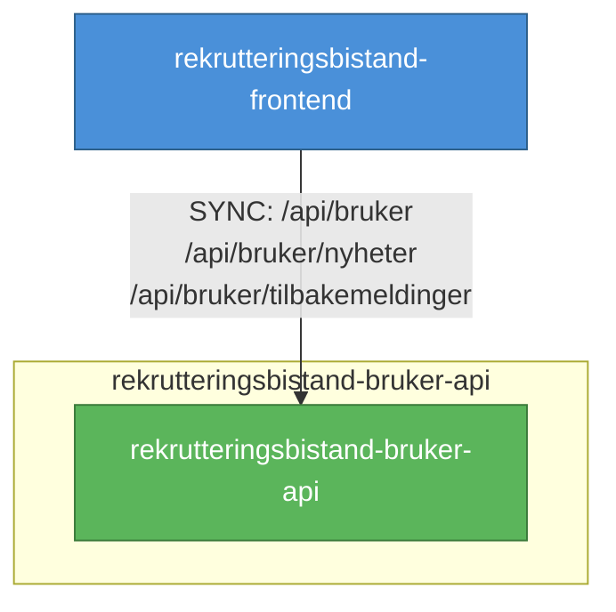

---

## rekrutteringsbistand-aktivitetskort

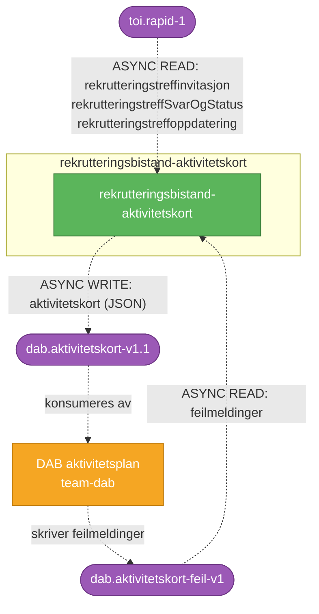

---

## toi-stilling-indekser

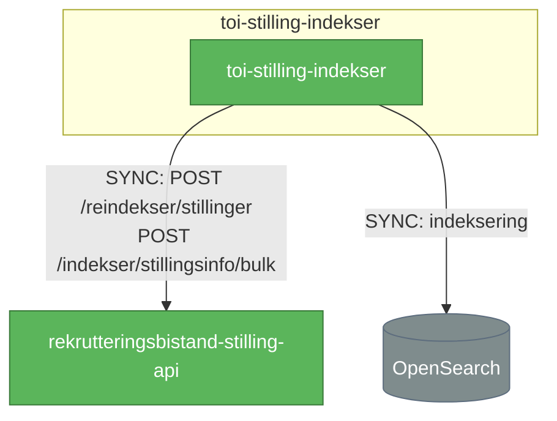

---

## toi-livshendelse

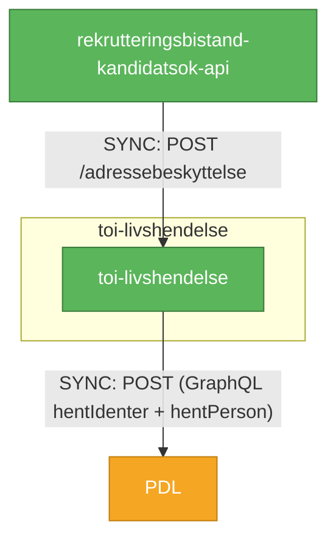

---

## toi-identmapper

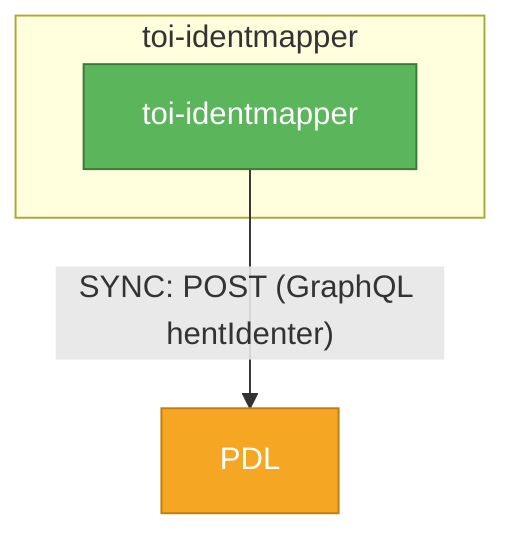

---

## toi-veileder

```mermaid
graph TB
    subgraph toi-veileder
        veileder[toi-veileder]
    end

    nom-api[nom-api]

    veileder -->|"SYNC: POST (GraphQL ressurser)"| nom-api

    classDef backend fill:#5bb55b,stroke:#3a7a3a,color:#fff
    classDef external fill:#f5a623,stroke:#c17d0e,color:#fff
    class veileder backend
    class nom-api external
```

---

## toi-organisasjonsenhet

```mermaid
graph TB
    subgraph toi-organisasjonsenhet
        organisasjonsenhet[toi-organisasjonsenhet]
    end

    norg2[norg2]

    organisasjonsenhet -->|"SYNC: GET /enhet<br>GET /enhet?enhetsnummerListe={nr}"| norg2

    classDef backend fill:#5bb55b,stroke:#3a7a3a,color:#fff
    classDef external fill:#f5a623,stroke:#c17d0e,color:#fff
    class organisasjonsenhet backend
    class norg2 external
```

---

## toi-ontologitjeneste

```mermaid
graph TB
    subgraph toi-ontologitjeneste
        ontologitjeneste[toi-ontologitjeneste]
    end

    pam-ontologi[pam-ontologi]

    ontologitjeneste -->|"SYNC: GET /kompetanse/?kompetansenavn={x}<br>GET /stilling/?stillingstittel={x}"| pam-ontologi

    classDef backend fill:#5bb55b,stroke:#3a7a3a,color:#fff
    classDef external fill:#f5a623,stroke:#c17d0e,color:#fff
    class ontologitjeneste backend
    class pam-ontologi external
```

---

## toi-geografi

```mermaid
graph TB
    subgraph toi-geografi
        geografi[toi-geografi]
    end

    pam-geografi[pam-geografi]

    geografi -->|"SYNC: GET /rest/postdata<br>GET /rest/geografier"| pam-geografi

    classDef backend fill:#5bb55b,stroke:#3a7a3a,color:#fff
    classDef external fill:#f5a623,stroke:#c17d0e,color:#fff
    class geografi backend
    class pam-geografi external
```

---

## toi-publisering-til-arbeidsplassen

```mermaid
graph TB
    subgraph toi-publisering-til-arbeidsplassen
        publisering[toi-publisering-til-arbeidsplassen]
    end

    arbeidsplassen[Arbeidsplassen stillingsimport]

    publisering -->|"SYNC: POST /stillingsimport/api/v1/transfers/{providerId}<br>DELETE /stillingsimport/api/v1/transfers/{providerId}/{ref}"| arbeidsplassen

    classDef backend fill:#5bb55b,stroke:#3a7a3a,color:#fff
    classDef external fill:#f5a623,stroke:#c17d0e,color:#fff
    class publisering backend
    class arbeidsplassen external
```

---

## toi-arbeidsgiver-notifikasjon

```mermaid
graph TB
    subgraph toi-arbeidsgiver-notifikasjon
        ag-notifikasjon[toi-arbeidsgiver-notifikasjon]
    end

    notifikasjon-api[notifikasjon-bruker-api]

    ag-notifikasjon -->|"SYNC: POST (GraphQL mutations)"| notifikasjon-api

    classDef backend fill:#5bb55b,stroke:#3a7a3a,color:#fff
    classDef external fill:#f5a623,stroke:#c17d0e,color:#fff
    class ag-notifikasjon backend
    class notifikasjon-api external
```

---

## Oppsummering

| System | Sync ut | Sync inn | Async ut | Async inn | Totalt |
|--------|---------|----------|----------|-----------|--------|
| rekrutteringsbistand-frontend | 15 | 0 | 0 | 0 | 15 |
| rekrutteringsbistand-stilling-api | 4 | 4 | 4 events | 2 topics | 14 |
| rekrutteringstreff-api | 3 | 2 | 4 events | 4 events | 13 |
| rekrutteringsbistand-kandidatvarsel-api | 2 | 1 | 2 topics | 2 topics | 7 |
| foresporsel-om-deling-av-cv-api | 3 | 1 | 2 topics | 2 topics | 8 |
| rekrutteringsbistand-kandidatsok-api | 4 | 4 | 0 | 0 | 8 |
| presenterte-kandidater-api | 2 | 1 | 2 events | 5 events | 10 |
| rekrutteringsbistand-statistikk-api | 0 | 1 | 1 topic | 9 events | 11 |
| rekrutteringsbistand-kandidat-api | 0 | 2 | 10 events | 0 | 12 |
| rekrutteringstreff-minside-api | 5 | 1 | 0 | 0 | 6 |
| rekrutteringsbistand-stillingssok-proxy | 1 | 3 | 0 | 0 | 4 |
| rekrutteringsbistand-aktivitetskort | 0 | 0 | 1 topic | 2 topics | 3 |
| rekrutteringsbistand-stilling-kafkabro | 0 | 0 | 1 topic | 1 topic | 2 |
| toi-stilling-indekser | 2 | 0 | 0 | 0 | 2 |
| presenterte-kandidater | 2 | 0 | 0 | 0 | 2 |
| rekrutteringstreff-bruker | 1 | 0 | 0 | 0 | 1 |
| vis-stilling | 1 | 0 | 0 | 0 | 1 |
| rekrutteringsbistand-bruker-api | 0 | 1 | 0 | 0 | 1 |
| toi-livshendelse | 1 | 1 | 0 | 0 | 2 |
| toi-identmapper | 1 | 0 | 0 | 0 | 1 |
| toi-veileder | 1 | 0 | 0 | 0 | 1 |
| toi-organisasjonsenhet | 1 | 0 | 0 | 0 | 1 |
| toi-ontologitjeneste | 1 | 0 | 0 | 0 | 1 |
| toi-geografi | 1 | 0 | 0 | 0 | 1 |
| toi-publisering-til-arbeidsplassen | 1 | 0 | 0 | 0 | 1 |
| toi-arbeidsgiver-notifikasjon | 1 | 0 | 0 | 0 | 1 |
